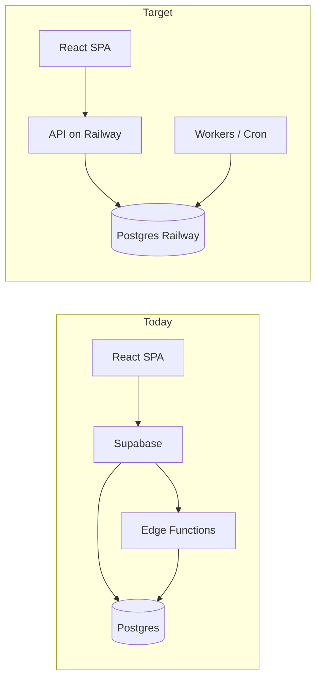

# DirtTrails architecture audit — Railway Postgres migration

> **Template only.** Copy this file to `audit-YYYY-MM-DD.md` and fill in. Do not commit findings into `AUDIT_TEMPLATE.md`.

| Field | Value |
|-------|--------|
| **Date** | YYYY-MM-DD |
| **Auditor** | (agent / human) |
| **Branch / commit** | |
| **Skills used** | using-superpowers, improve-codebase-architecture, supabase-postgres-best-practices |
| **Scope** | Full repo / subset: |

---

## 1. Executive summary

<!-- ≤ 15 bullets: biggest risks, top wins, recommended first move -->

-

---

## 2. Risk register

| ID | Area | Risk | Severity (H/M/L) | Mitigation | Owner |
|----|------|------|------------------|------------|-------|
| R1 | Auth | | | | |
| R2 | Payments | | | | |
| R3 | Data loss | | | | |
| R4 | Downtime | | | | |
| R5 | Security | | | | |

---

## 3. Supabase surface area (coupling map)

### 3.1 Inventory table

| Surface | Locations (paths) | Count / notes | Railway migration |
|---------|-------------------|---------------|-------------------|
| PostgREST (`from`, `select`, …) | | | → API + server queries |
| `supabase.rpc` | | | → procs or app transactions |
| RLS policies | `supabase/migrations/` | | → app authz / DB roles |
| `supabase.auth` | | | → |
| `supabase.storage` | | | → |
| Edge Functions | `supabase/functions/` | | → Railway service / cron |
| Realtime | | | → |
| Service role in frontend | `src/lib/serviceClient.ts` | | **Remove** |
| Env vars | `VITE_SUPABASE_*` | | → server-only |

### 3.2 Diagram



### 3.3 Direct `supabase` bypasses (outside `database.ts`)

| File | Usage | Action |
|------|-------|--------|
| | | |

---

## 4. Code architecture friction

### 4.1 God module & types

| Issue | Evidence (file:line or path) | Impact |
|-------|------------------------------|--------|
| `database.ts` size / exports | | |
| Duplicate types (`src/types` vs `database.ts`) | | |
| Pages importing data layer directly | | |

### 4.2 Domain clusters

| Domain | Key files | Coupled to |
|--------|-----------|------------|
| Bookings | | |
| Services | | |
| Auth / profiles | | |
| Messages | | |
| Wallet / payments | | |
| Reviews | | |
| Visitor tracking | | |
| Admin | | |
| Vendor | | |

### 4.3 Dependency classification (deep-module lens)

| Module / cluster | Category (1–4) | Notes |
|------------------|------------------|-------|
| | 1 In-process | |
| | 2 Local-substitutable | |
| | 3 Remote-owned (ports) | |
| | 4 True external (mock) | |

---

## 5. Postgres review (best practices)

Reference rule prefixes where relevant: `query-`, `conn-`, `security-`, `schema-`, `lock-`, `data-`, `monitor-`, `advanced-`.

### 5.1 Schema & migrations

| Finding | Rule / category | Location | Recommendation |
|---------|-----------------|----------|----------------|
| | | | |

### 5.2 Hot queries & RPCs

| Flow | Pattern issue | Fix |
|------|---------------|-----|
| | | |

### 5.3 RLS → post-Supabase authz

| Policy / table | Current behavior | Proposed replacement |
|----------------|------------------|----------------------|
| | | |

### 5.4 Railway connection & pooling

| Topic | Recommendation |
|-------|----------------|
| Pooler (PgBouncer / etc.) | |
| Max connections | |
| Serverless vs long-lived API | |

---

## 6. Deepening candidates (Phase 2)

<!-- Numbered; no interface designs here. User picks one for follow-up RFC. -->

### Candidate 1: [name]

- **Cluster**:
- **Why coupled**:
- **Dependency category**:
- **Test impact**:

### Candidate 2: [name]

- **Cluster**:
- **Why coupled**:
- **Dependency category**:
- **Test impact**:

### Recommended priority order

1.
2.
3.

**Question for owner:** Which candidate to explore first? (Suggested: #___)

---

## 7. Target architecture

### 7.1 Principles

-

### 7.2 Folder tree (proposed)

```
src/
  domain/
  ports/
  adapters/
    postgres/
    http/
  api/          # or separate repo
```

### 7.3 Opinionated choices

| Decision | Recommendation | Alternatives considered |
|----------|----------------|-------------------------|
| Query layer (ORM) | | Drizzle / Kysely / raw `pg` |
| Auth | | |
| File storage | | |
| API framework | | |
| Monorepo vs split API | | |

### 7.4 Edge Functions → Railway map

| Function | Today | Target deployment |
|----------|-------|-------------------|
| `marzpay-collect` | | |
| `marzpay-webhook` | | |
| … | | |

### 7.5 Testing pyramid

| Layer | What to test | Tooling |
|-------|--------------|---------|
| Unit | | |
| Integration (adapters) | | Docker / PGLite |
| API contract | | |
| E2E | | defer: |

---

## 8. Migration roadmap

| Phase | Scope | Exit criteria | Rollback |
|-------|--------|---------------|----------|
| 0 | Prep (ports, local Postgres) | | |
| 1 | API skeleton | | |
| 2 | Read paths | | |
| 3 | Writes + RPCs | | |
| 4 | Auth + storage | | |
| 5 | Edge functions | | |
| 6 | Decommission Supabase | | |

**Strangler fig order:** (e.g. bookings first → …)

---

## 9. Week 1 task list

| # | Task | Est. size | PR title idea |
|---|------|-----------|---------------|
| 1 | | S/M/L | |
| 2 | | | |
| 3 | | | |
| 4 | | | |
| 5 | | | |
| 6 | | | |
| 7 | | | |
| 8 | | | |
| 9 | | | |
| 10 | | | |

---

## 10. Open questions (owner decisions)

| # | Question | Options | Decision |
|---|----------|---------|----------|
| 1 | ORM vs query builder | | |
| 2 | Monorepo vs API repo | | |
| 3 | Auth vendor / custom | | |
| 4 | | | |

---

## Appendix A — `database.ts` export groups (optional)

| Group | Export count | Split target module |
|-------|--------------|---------------------|
| | | |

## Appendix B — Edge Functions inventory

| Function | Trigger | DB / external deps |
|----------|---------|-------------------|
| | | |

## Appendix C — References

- Audit prompt: `RAILWAY_MIGRATION_ARCHITECTURE_AUDIT_PROMPT.md`
- Migrations: `docs/MIGRATIONS.md`
- Prior audits: (link other `audit-*.md` files)
