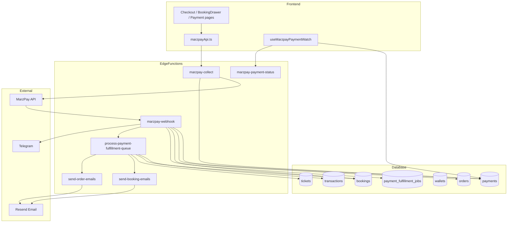
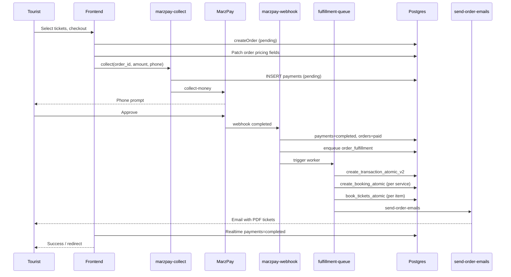

# Dirt Trails — Money Cycle Architecture

> **Last updated:** 2026-06-12  
> **Sources:** Frontend codebase (`dirt-t-frontend`), Supabase project **Travel Tails** (`ywxvgfhwmnwzsafwmpil`), live DB introspection via Supabase MCP, and deployed Edge Functions.

This document describes the **end-to-end flow of money** on Dirt Trails: from a customer initiating payment, through MarzPay mobile money, database state changes, vendor/platform settlement, bookings/tickets, and confirmation emails.

---

## Table of contents

1. [Executive summary](#1-executive-summary)
2. [System map](#2-system-map)
3. [Pricing & commission (before payment)](#3-pricing--commission-before-payment)
4. [Path A — Service bookings (hotel, tour, transport, activity…)](#4-path-a--service-bookings-hotel-tour-transport-activity)
5. [Path B — Ticket / event orders](#5-path-b--ticket--event-orders)
6. [Path C — Special flows](#6-path-c--special-flows)
7. [MarzPay integration](#7-marzpay-integration)
8. [Post-payment fulfillment queue](#8-post-payment-fulfillment-queue)
9. [Wallet & ledger settlement](#9-wallet--ledger-settlement)
10. [Emails & notifications](#10-emails--notifications)
11. [Database tables](#11-database-tables)
12. [Database RPCs (live production)](#12-database-rpcs-live-production)
13. [Edge functions (deployed)](#13-edge-functions-deployed)
14. [Status transitions](#14-status-transitions)
15. [Known gaps & architectural risks](#15-known-gaps--architectural-risks)
16. [File index](#16-file-index)

---

## 1. Executive summary

Dirt Trails uses **MarzPay** for **mobile money** (MTN / Airtel, UGX). Money does **not** sit in the app — MarzPay collects from the customer's phone. The platform records the outcome in Postgres and (when configured correctly) credits **vendor wallets** and the **platform (admin) wallet**.

There are **two settlement architectures** in the codebase:

| Architecture | When used | Commission split | Wallet credit |
|---|---|---|---|
| **MarzPay async (primary)** | Checkout, BookingDrawer, transport/hotel pages | Calculated at quote time; **not** applied in fulfillment worker | Worker calls `create_transaction_atomic_v2` → **ledger only** (see §15) |
| **Repository sync (legacy)** | Admin updates, reconciliation, `confirmOrderAndIssueTickets` | Intended via `process_payment_with_commission` | `process_payment_atomic` or manual `creditWallet` |

**Production DB note (verified 2026-06-12):** `process_payment_with_commission` exists in repo SQL (`db/005_concurrency_controls.sql`) but is **not deployed** on Travel Tails. Reconciliation code falls back to `addTransaction` + `creditWallet` or `process_payment_atomic`.

---

## 2. System map



---

## 3. Pricing & commission (before payment)

### 3.1 Quote-time RPC: `get_effective_pricing`

**Migration:** `supabase/migrations/20260530200001_get_effective_pricing_rpc.sql`  
**Client:** `src/repositories/PricingRepository.ts`, `src/services/PricingService.ts`

**Resolution order:**
1. Active `service_pricing_overrides` (if `override_enabled` and within date range)
2. Else `vendor_tiers` via vendor's `manual_tier_id` (if not expired) or `current_tier_id`

**Platform fee calculation:**
- `flat` → fixed `override_value` / tier `commission_value`
- `percentage` → `base_price × rate`

**Fee payer (`fee_payer`):** `vendor` | `tourist` | `shared`

| `fee_payer` | Customer pays | Vendor receives (`vendor_payout`) |
|---|---|---|
| `vendor` | `base_price` | `base − platform_fee` |
| `tourist` | `base + platform_fee` | `base` |
| `shared` | `base + tourist_share` | `base − vendor_share` |

**Returned fields:** `platform_fee`, `total_customer_payment`, `vendor_payout`, `pricing_source`, `pricing_reference_id`, `fee_payer`.

### 3.2 Persisted on records before collect

**Orders** (`useOrderPaymentFlow.payOrder`, `Payment.tsx`):
- `total_amount`, `base_price`, `platform_fee`, `vendor_payout`, `fee_payer`, `pricing_source`, `pricing_reference_id`

**Bookings** (`create_booking_atomic`):
- `commission_rate_at_booking`, `commission_amount`, `vendor_payout_amount`, `platform_fee`, `base_price`, `fee_payer`

> Pricing is computed **before** MarzPay collect. The customer is charged `total_amount` (or booking `total_amount`). Commission fields are stored for reporting and reconciliation — they are **not automatically enforced** in the MarzPay fulfillment worker (see §15).

### 3.3 Transport-specific fees (settlement only)

In `process-payment-fulfillment-queue`, transport bookings (`services.category_id = 'cat_transport'`) apply a **separate 2%+2% model** at wallet-credit time:

```
paidTotal = booking.total_amount
subtotal  = paidTotal / 1.02          // hirer 2% stripped
vendorCredit = subtotal × 0.98          // provider 2% stripped
```

Constants: `HIRER_TRANSPORT_FEE_RATE = 0.02`, `PROVIDER_TRANSPORT_FEE_RATE = 0.02`  
(`marzpay-webhook`, `process-payment-fulfillment-queue`)

---

## 4. Path A — Service bookings (hotel, tour, transport, activity)

### Step-by-step

| Step | Actor | Action |
|---|---|---|
| 1 | Tourist | Fills booking form (BookingDrawer, TransportBooking, HotelBooking, etc.) |
| 2 | Frontend | `BookingRepository.createBooking()` → RPC **`create_booking_atomic`** |
| 3 | DB | Inserts `bookings` row: `status=pending`, `payment_status=pending` |
| 4 | Frontend | Calls **`marzpay-collect`** with `booking_id`, `amount`, `phone_number` |
| 5 | `marzpay-collect` | INSERT `payments` (`status=pending`), POST MarzPay `/collect-money` |
| 6 | Tourist | Approves prompt on phone |
| 7 | MarzPay | POST **`marzpay-webhook`** with `transaction.reference` |
| 8 | Webhook | UPDATE `payments.status=completed` |
| 9 | Webhook | UPDATE `bookings`: `status=confirmed`, `payment_status=paid`, `payment_reference` |
| 10 | Webhook | UPSERT `payment_fulfillment_jobs` (`job_type=booking_fulfillment`) |
| 11 | Webhook | Triggers **`process-payment-fulfillment-queue`** |
| 12 | Worker | RPC **`create_transaction_atomic_v2`** (vendor ledger entry) |
| 13 | Worker | POST **`send-booking-emails`** `{ booking_id }` |
| 14 | Frontend | `useMarzpayPaymentWatch` sees `payments.status=completed` → success UI |

### Restaurant exception

`RestaurantBooking.tsx` creates a booking as **`confirmed`** with **no payment** and calls `send-booking-emails` directly.

### Booking creation RPC

**`create_booking_atomic`** (latest: `supabase/migrations/20260406160000_create_booking_atomic_pricing_base_param.sql`)

- Locks service capacity
- Stores commission snapshot on the booking row
- Does **not** move money

---

## 5. Path B — Ticket / event orders

### Step-by-step

| Step | Actor | Action |
|---|---|---|
| 1 | Tourist | Selects tickets on service detail → `OrderRepository.createOrder()` |
| 2 | DB | INSERT `orders` (`status=pending`) + `order_items` |
| 3 | Frontend | Checkout (`Checkout.tsx`) → `useOrderPaymentFlow.payOrder()` patches pricing fields on order |
| 4 | Frontend | **`marzpay-collect`** with `order_id` |
| 5–8 | Same as Path A | MarzPay → webhook updates `payments` |
| 9 | Webhook | UPDATE `orders`: `status=paid`, `reference`, `payment_method=mobile_money` |
| 10 | Webhook | Enqueue `order_fulfillment` job → trigger worker |
| 11 | Worker | **`create_transaction_atomic_v2`** for gross `job.payload.amount` |
| 12 | Worker | Per service group: **`create_booking_atomic`** + **`update_booking_status_atomic`** (confirmed/paid) |
| 13 | Worker | Per line item: **`book_tickets_atomic`** → INSERT `tickets` (`status=issued`) |
| 14 | Worker | Fire-and-forget **`send-order-emails`** with PDF tickets + QR codes |
| 15 | Frontend | Redirect to tickets / success state |

### Inventory guards (`marzpay-collect`)

- Max 5 payment attempts per order
- Dedup in-flight `payments` (pending/processing)
- Ticket availability check on `ticket_types`

### Abandoned orders

**`expire-abandoned-orders`** (cron): `orders` pending > 2 hours → `status=expired`

---

## 6. Path C — Special flows

| Flow | Entry | Payment | Settlement |
|---|---|---|---|
| **Wallet top-up** | `src/pages/Wallet.tsx` | `marzpay-collect` with `metadata.type=wallet_topup` | `deposit_to_wallet` / `wallet_transactions` (tourist wallet — separate from vendor `wallets`) |
| **Conservation donate** | `src/pages/conservation/Donate.tsx` | MarzPay with synthetic reference | `create_transaction_with_meta_atomic` |
| **Carbon offset** | `src/pages/conservation/OffsetCheckout.tsx` | MarzPay collect | Queue / transaction path |
| **Legacy sync confirm** | `OrderRepository.confirmOrderAndIssueTickets` | N/A (manual/admin) | `process_payment_with_commission` (not in prod DB) — **not used by current UI** |

---

## 7. MarzPay integration

### Edge function: `marzpay-collect`

**File:** `supabase/functions/marzpay-collect/index.ts`

**Input:** `{ amount, phone_number, order_id?, booking_id?, user_id?, metadata? }`

**Actions:**
1. Validate UUIDs, amount match (orders), inventory
2. Generate `reference` (UUID)
3. POST `https://wallet.wearemarz.com/api/v1/collect-money`
4. Callback URL: `{SUPABASE_URL}/functions/v1/marzpay-webhook?secret={MARZPAY_WEBHOOK_SECRET}`
5. INSERT **`payments`** row

### Edge function: `marzpay-webhook`

**File:** `supabase/functions/marzpay-webhook/index.ts`

**Auth:** `MARZPAY_WEBHOOK_SECRET` (query param or header)

**On `completed`:**
- Link payment → booking or order
- Set booking/order paid state
- Enqueue fulfillment job (idempotency key: `{job_type}:{source_id}:{reference}`)
- Trigger queue worker
- Telegram alert (orders)

**Important:** Webhook does **not** create transactions, tickets, or emails directly — the queue worker owns fulfillment (prevents double-issuance).

### Frontend watch

**`src/hooks/useMarzpayPaymentWatch.ts`**
- Supabase Realtime subscription on `payments` filtered by `reference`
- Fallback poll via **`marzpay-payment-status`**

See also: `docs/MARZPAY_SETUP.md`

---

## 8. Post-payment fulfillment queue

### Table: `payment_fulfillment_jobs`

| Column | Purpose |
|---|---|
| `job_type` | `booking_fulfillment` \| `order_fulfillment` |
| `source_id` | `bookings.id` or `orders.id` |
| `payload` | `{ reference, amount, transport_fee_rates? }` |
| `idempotency_key` | Prevents duplicate jobs |
| `status` | `pending` → `processing` → `completed` \| `failed` |
| `attempts` / `max_attempts` | Exponential backoff, max 6 |

### Worker: `process-payment-fulfillment-queue`

**Claim jobs:** RPC **`claim_payment_jobs`** (batch default 8)

**`booking_fulfillment`:**
1. Skip if completed payment transaction already exists for `booking_id`
2. Compute vendor credit (transport fee math or full `total_amount`)
3. **`create_transaction_atomic_v2`**
4. **`send-booking-emails`**

**`order_fulfillment`:**
1. Skip if transaction exists for `reference`
2. **`create_transaction_atomic_v2`** (full payment amount)
3. Idempotency: skip if bookings/tickets already exist for reference/order
4. **`create_booking_atomic`** + **`update_booking_status_atomic`** per service
5. **`book_tickets_atomic`** per order item
6. **`send-order-emails`**

---

## 9. Wallet & ledger settlement

### Vendor wallets (`wallets` table)

| Column | Description |
|---|---|
| `vendor_id` | FK to vendor profile |
| `balance` | Current balance (UGX default) |
| `currency` | e.g. `UGX` |

### Transactions ledger (`transactions` table)

Records every payment, withdrawal, refund. Key columns: `booking_id`, `vendor_id`, `tourist_id`, `amount`, `transaction_type`, `status`, `payment_method`, `reference`.

### RPC chain (production)

```
create_transaction_atomic_v2(...)
  └─► create_transaction_atomic(...)   // INSERT into transactions ONLY

process_payment_atomic(...)
  ├─► create_transaction_atomic(...)
  └─► update_wallet_balance_atomic(...)  // Credits vendor wallet

update_wallet_balance_atomic(vendor_id, amount, currency, 'credit'|'debit')
```

**Critical:** The MarzPay fulfillment worker uses `create_transaction_atomic_v2`, which **does not credit wallets**. Wallet balances are updated when:

1. **`process_payment_atomic`** is called (legacy path)
2. **`WalletRepository.creditWallet`** → `update_wallet_balance_atomic` (reconciliation fallback)
3. Vendor opens **Transactions** page → `reconcileMissingPaymentTransactions(vendorId)` backfills missing wallet credits for `confirmed` + `paid` bookings

### Commission / platform share (intended)

**Designed RPC (not in production):** `process_payment_with_commission`
- Credit vendor: `total − commission`
- Credit admin/platform wallet: `commission`
- Called from `BookingRepository`, `OrderRepository`, `WalletRepository`

**Reconciliation fallback** (`WalletRepository.reconcileMissingPaymentTransactions`):
- If RPC missing → `addTransaction` + `creditWallet(vendor, vendor_payout)` + `creditWallet(admin, commission)`

### Withdrawals

`WalletRepository.requestWithdrawal()` → INSERT transaction `type=withdrawal`, `status=pending` (manual admin processing implied).

### Tourist wallets (separate subsystem)

Tables/functions: `tourist_wallets`, `wallet_transactions`, `deposit_to_wallet`, `pay_from_wallet`, `complete_wallet_deposit` — used for tourist wallet top-up/spend, not vendor settlement.

---

## 10. Emails & notifications

| Email / notification | Edge function | Triggered when | Recipients |
|---|---|---|---|
| Booking confirmation | `send-booking-emails` | Queue worker after paid booking; `BookingRepository` if already paid; restaurant reserve | Tourist (`guest_email` or profile), vendor (`business_email`) |
| Order tickets PDF | `send-order-emails` | Queue worker after order fulfillment | `guest_email` or profile email |
| Review request | `send-review-email` | `BookingRepository.updateBooking` when `status=completed` | Tourist |
| Payment Telegram | inline in `marzpay-webhook` | Order payment completed/failed | Configured chat IDs |
| Booking issue audit | `reconcile-booking` | Admin approve/reject flagged booking | Internal `booking_issues` table |

**Email provider:** Resend (`RESEND_API_KEY`, `FROM_EMAIL`)

**Booking email contents:** HTML confirmation; optional PDF attachment when `ENABLE_BOOKING_PDF=true`

**Order email contents:** HTML summary + PDF with ticket QR codes (`buildTicketsPdf`)

---

## 11. Database tables

### Core money cycle

| Table | Role in money cycle |
|---|---|
| `payments` | One row per MarzPay attempt; links `order_id` or `booking_id`; authoritative payment status from webhook |
| `orders` | Ticket checkout cart; pricing breakdown; `paid` after webhook |
| `order_items` | Line items (`ticket_type_id`, `quantity`, `unit_price`) |
| `bookings` | Service reservations; commission snapshot; `confirmed`/`paid` after webhook |
| `tickets` | Issued codes after order fulfillment (`book_tickets_atomic`) |
| `ticket_types` | Inventory (`quantity`, `sold`) |
| `transactions` | Financial ledger |
| `wallets` | Vendor (and platform) balances |
| `payment_fulfillment_jobs` | Async post-payment work queue |

### Pricing configuration

| Table | Role |
|---|---|
| `vendor_tiers` | Commission rules (flat/percentage, fee_payer) |
| `service_pricing_overrides` | Per-service fee overrides |
| `services` | Base price, vendor, capacity, category |
| `vendors` | Tier assignment, `business_email` |

### Supporting

| Table | Role |
|---|---|
| `profiles` | Tourist/admin identity, emails |
| `booking_issues` | Admin reconciliation audit trail |
| `review_tokens` | Post-completion review links |

### Live schema snapshot (`payments`)

```
id, user_id, booking_id, order_id, amount, phone_number, reference,
provider, status, transaction_uuid, provider_reference,
marzpay_response, webhook_data, metadata, created_at, updated_at
```

---

## 12. Database RPCs (live production)

Verified on **Travel Tails** (`ywxvgfhwmnwzsafwmpil`) via Supabase MCP:

| RPC | Present | Role |
|---|---|---|
| `get_effective_pricing` | ✅ | Quote-time fee/payout calculation |
| `create_booking_atomic` | ✅ | Create pending booking with commission snapshot |
| `update_booking_status_atomic` | ✅ | Atomic status/payment_status update |
| `book_tickets_atomic` | ✅ | Issue tickets, decrement inventory |
| `create_transaction_atomic` | ✅ | Insert ledger row only |
| `create_transaction_atomic_v2` | ✅ | Wrapper → `create_transaction_atomic` |
| `create_transaction_with_meta_atomic` | ✅ | Ledger with metadata (donations) |
| `process_payment_atomic` | ✅ | Ledger + vendor wallet credit (full amount) |
| `process_payment_with_commission` | ❌ **Not deployed** | Intended vendor + platform split |
| `update_wallet_balance_atomic` | ✅ | Credit/debit vendor wallet |
| `claim_payment_jobs` | ✅ | Queue worker job claiming |
| `recover_stuck_payment_jobs` | ✅ | Queue maintenance |
| `calculate_payment` | ✅ | Legacy pricing helper |
| `deposit_to_wallet` / `pay_from_wallet` | ✅ | Tourist wallet subsystem |
| `get_or_create_wallet` | ✅ | Wallet bootstrap |

---

## 13. Edge functions (deployed)

| Function | JWT verify | Purpose |
|---|---|---|
| `marzpay-collect` | yes | Initiate mobile money collection |
| `marzpay-webhook` | no (secret) | MarzPay callback handler |
| `marzpay-payment-status` | no | Poll payment status by reference |
| `process-payment-fulfillment-queue` | yes (worker secret) | Async fulfillment worker |
| `send-booking-emails` | no | Booking confirmation emails |
| `send-order-emails` | no | Ticket PDF emails |
| `send-review-email` | yes | Post-stay review request |
| `expire-abandoned-orders` | yes | Cron: expire stale orders |
| `reconcile-booking` | — | Admin booking issue audit (not in deployed list — code exists in repo) |

---

## 14. Status transitions

### `payments`
```
pending | processing → completed | failed
```
Set by: `marzpay-collect` (initial), `marzpay-webhook` (authoritative)

### `bookings`
```
create_booking_atomic     → pending / pending
webhook completed         → confirmed / paid
payment failure (client)  → cancelled / pending
admin approve flagged     → confirmed / paid
admin reject              → cancelled / pending
vendor lifecycle          → completed → review email
```

### `orders`
```
createOrder               → pending
webhook completed         → paid
expire-abandoned-orders   → expired (>2h)
```

### `tickets`
```
book_tickets_atomic → issued
scan / verify       → used
```

### `payment_fulfillment_jobs`
```
pending → processing → completed
                     → failed (after max_attempts, with retries)
```

---

## 15. Known gaps & architectural risks

### 15.1 Dual settlement paths

MarzPay production flow and repository sync path **do not share the same commission logic**. Mobile-money settlements via the queue worker record transactions but may **not** split platform fee or credit wallets immediately.

### 15.2 `process_payment_with_commission` not deployed

Code in `BookingRepository`, `OrderRepository`, and `WalletRepository` calls this RPC. Production DB does not have it. Reconciliation uses fallback paths when the RPC is missing.

### 15.3 Queue worker does not credit wallets

`create_transaction_atomic_v2` → `create_transaction_atomic` inserts into `transactions` **only**. No `update_wallet_balance_atomic` call in the worker.

**Practical effect:** Vendor wallet balance may lag until:
- Vendor visits Transactions page (`reconcileMissingPaymentTransactions`)
- Admin/manual reconciliation runs
- Legacy sync path executes

### 15.4 Commission stored but not enforced on MarzPay path

`platform_fee` / `vendor_payout` on orders and `commission_amount` on bookings are populated at creation, but the fulfillment worker credits **gross amount** (or transport-adjusted amount), not `vendor_payout`.

### 15.5 `confirmOrderAndIssueTickets` unused

Implemented in `OrderRepository.ts` with proper commission split intent, but **not called** by current checkout UI. Ticket fulfillment is entirely queue-driven.

### 15.6 Transport fees only at settlement

2%+2% transport model is applied in the worker, not in `get_effective_pricing`.

---

## 16. File index

### Frontend entry points
| File | Role |
|---|---|
| `src/pages/Checkout.tsx` | Ticket checkout |
| `src/hooks/useOrderPaymentFlow.ts` | Order payment + pricing patch |
| `src/pages/Payment.tsx` | Legacy payment (redirects to checkout) |
| `src/components/BookingDrawer.tsx` | In-drawer booking + pay |
| `src/pages/TransportBooking.tsx` | Transport booking + MarzPay |
| `src/pages/HotelBooking.tsx` | Hotel booking + MarzPay |
| `src/lib/marzpayApi.ts` | `initiateMarzpayCollect`, status poll |
| `src/hooks/useMarzpayPaymentWatch.ts` | Realtime + poll watcher |

### Repositories
| File | Role |
|---|---|
| `src/repositories/BookingRepository.ts` | Create/update bookings, email triggers, sync settlement |
| `src/repositories/OrderRepository.ts` | Orders, tickets, legacy confirm |
| `src/repositories/WalletRepository.ts` | Wallets, withdrawals, reconciliation |
| `src/repositories/PricingRepository.ts` | `get_effective_pricing` client |

### Edge functions
| File | Role |
|---|---|
| `supabase/functions/marzpay-collect/index.ts` | Payment initiation |
| `supabase/functions/marzpay-webhook/index.ts` | Webhook + enqueue |
| `supabase/functions/process-payment-fulfillment-queue/index.ts` | Fulfillment worker |
| `supabase/functions/send-booking-emails/index.ts` | Booking emails |
| `supabase/functions/send-order-emails/index.ts` | Ticket emails |
| `supabase/functions/expire-abandoned-orders/index.ts` | Order expiry cron |

### SQL / migrations
| File | Role |
|---|---|
| `db/005_concurrency_controls.sql` | `process_payment_atomic`, `book_tickets_atomic`, wallet RPCs |
| `db/032_create_payment_fulfillment_queue.sql` | Queue table |
| `supabase/migrations/20260530200001_get_effective_pricing_rpc.sql` | Pricing RPC |
| `supabase/migrations/20260406160000_create_booking_atomic_pricing_base_param.sql` | Booking RPC |
| `supabase/migrations/20260530200000_claim_payment_jobs_rpc.sql` | Job claiming |

### Related docs
| File | Role |
|---|---|
| `docs/MARZPAY_SETUP.md` | MarzPay env vars and webhook URL |
| `docs/architecture/audit-2026-06-03.md` | Broader architecture audit |

---

## Appendix: End-to-end sequence (ticket order)



---

*Document generated from codebase analysis and live Supabase schema introspection. For environment setup see `docs/MARZPAY_SETUP.md`.*
