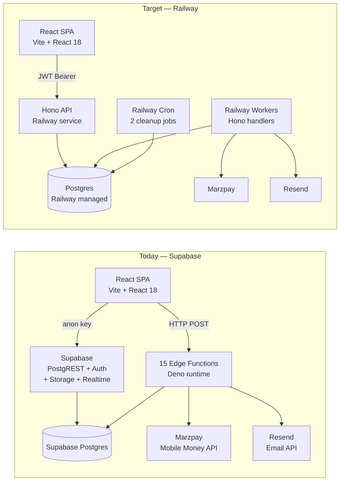

# DirtTrails architecture audit — Railway Postgres migration

| Field | Value |
|-------|--------|
| **Date** | 2026-06-03 |
| **Auditor** | Claude Sonnet 4.6 (claude-code) |
| **Branch / commit** | main / 66b7a67c |
| **Skills used** | using-superpowers, improve-codebase-architecture |
| **Scope** | Full repo — all src/, supabase/functions/, supabase/migrations/ |

---

## 1. Executive summary

- **CRITICAL security bug now:** `src/lib/serviceClient.ts` exposes `VITE_SUPABASE_SERVICE_ROLE_KEY` in the frontend bundle — it bypasses all RLS and grants full DB access to anyone who reads the network tab. Delete this file before the next deploy.
- **Zero automated test coverage** — 1 test file exists (`src/tests/tierEvaluation.test.ts`); everything else is untested. The migration will be flying blind without at minimum integration tests on the booking and payment critical paths.
- **`database.ts` is the single biggest blocker** — 7,891 lines, 176 exported functions, imports the Supabase client directly, mixes all 10 domains. It cannot be tested, cannot be type-safely swapped, and makes every PR a merge-conflict risk.
- **11+ component files bypass `database.ts`** and call `supabase.from()` directly (booking cancellation logic is duplicated in 5 separate pages).
- **26 atomic RPCs** drive all money-touching flows; they are Postgres stored procedures and must be preserved as stored procedures or equivalent app-layer transactions on Railway — they cannot be silently dropped.
- **3 realtime subscriptions** on the `payments` table drive the payment status UX. On Railway this needs Postgres `LISTEN/NOTIFY` via a WebSocket channel or a polling fallback (a polling fallback already exists in BookingDrawer with a 4-second interval and 120-second timeout).
- **15 Edge Functions** — 10 are stateless HTTP workers (email + payment), 2 are cron cleanup jobs, 3 are the Marzpay payment pipeline. The cron jobs are the only ones that require a scheduler; the rest map directly to Hono route handlers.
- **Auth is purely email/password + Supabase JWT**; no social login, no passkeys. The simplest replacement is a custom JWT backed by `profiles.password_hash` — avoids a vendor dependency entirely and matches the existing schema.
- **RLS policies are thin and well-clustered** — mostly `auth.uid()` row ownership checks. Moving them to middleware-layer authorization is straightforward; the real risk is the admin RPCs tagged `SECURITY DEFINER` which currently bypass RLS and must be replaced with backend-only routes behind admin middleware.
- **Type system is fragmented**: visitor/analytics types live in `database.ts`, product types live in `src/types/index.ts`. `AuthContext.tsx` defines its own `Vendor` interface locally — three separate Vendor shapes exist across the codebase.
- **React Query is almost unused** — 2 of ~100+ data-fetching hooks use it. All other pages manage loading/error state manually in `useEffect`. This is the cheapest early win: wrapping `database.ts` calls in React Query gives cache dedup and refetch for free.
- **Recommended strangler fig order:** payments (highest risk) → bookings → auth → services/search → messaging → admin/vendor → decommission.
- **Week 1 non-negotiable:** delete `serviceClient.ts`, add local Postgres via Docker Compose, extract `BookingRepository` from `database.ts` with a `DatabasePort` interface.
- **Biggest non-obvious lift:** the Marzpay payment pipeline (collect → webhook → fulfillment queue → booking confirmation) is distributed across 3 Edge Functions, a `payments` table realtime subscription, and `process-payment-fulfillment-queue` with deduplication via `claim_payment_jobs` RPC. This end-to-end flow must be reproduced faithfully on Railway before Supabase is removed.

---

## 2. Risk register

| ID | Area | Risk | Severity | Mitigation | Owner |
|----|------|------|----------|------------|-------|
| R1 | Security | `VITE_SUPABASE_SERVICE_ROLE_KEY` exposed in frontend bundle — anyone can read all DB data and bypass RLS | **H** | Delete `serviceClient.ts` immediately; rotate the service role key in Supabase dashboard | Dev lead |
| R2 | Payments | Marzpay webhook → fulfillment queue is stateful and uses `claim_payment_jobs` RPC for deduplication; if Railway worker crashes mid-job, bookings may land in a half-confirmed state | **H** | Reproduce `claim_payment_jobs` atomically; add idempotency key; write integration test for rollback path | Payment owner |
| R3 | Auth | Supabase JWTs are verified by Supabase's secret — replacing auth means re-issuing tokens; all active sessions will be invalidated | **H** | Implement new auth behind a feature flag; run dual auth until all sessions naturally expire or force re-login in a maintenance window | Auth owner |
| R4 | Data loss | 26 `SECURITY DEFINER` RPCs run with elevated Postgres privileges and enforce transactional integrity; if naively replaced with multi-step app code, a crash between steps leaves orphaned records | **H** | Keep RPCs in Railway Postgres (they are plain SQL stored procedures); migrate the RPC, not the logic | DB owner |
| R5 | Downtime | Switching Supabase PostgREST → Railway API is a hard cutover for the browser client; no gradual per-user rollout is currently possible | **M** | Add API version header; route 1% traffic to Railway API first using CloudFlare Workers or Vite proxy config | Infra |
| R6 | Storage | `geotagging_images` and `partner-logos` buckets are publicly read, authenticated write; 3 conservation pages depend on them | **M** | Set up Cloudflare R2 (S3-compatible); update bucket paths via env var before Supabase storage decommission | Dev |
| R7 | Realtime | 3 `supabase.channel()` subscriptions on the `payments` table drive payment status UX; removing Supabase removes these | **M** | Backup polling already exists (4-second interval, 120-second timeout in BookingDrawer); can ship without realtime on Railway, add `LISTEN/NOTIFY` later | Dev |
| R8 | Env vars | `VITE_SUPABASE_URL` and `VITE_SUPABASE_ANON_KEY` are baked into the Vite build; changing them requires a full rebuild | **L** | Replace with `VITE_API_URL` pointing to Railway; anon key concept disappears when there is no PostgREST | Infra |

---

## 3. Supabase surface area (coupling map)

### 3.1 Inventory table

| Surface | Locations (paths) | Count / notes | Railway migration |
|---------|-------------------|---------------|-------------------|
| PostgREST (`from`, `select`, …) | `src/lib/database.ts` (primary), 11+ component files | ~720 call-sites across 67 files | → Hono API routes + Kysely queries on Railway server |
| `supabase.rpc` | `database.ts`, `concurrency.ts`, `creditWallet.ts`, `vendorStore.ts`, `conservation/Donate.tsx`, `conservation/OffsetCheckout.tsx` | 26 unique RPC names | → Keep as Postgres stored procedures; call via `pg` driver from API |
| RLS policies | `supabase/migrations/*.sql` (14 files) | Ownership checks + admin checks | → Middleware authz (JWT role claim) + row-level checks in repository layer |
| `supabase.auth` | `src/contexts/AuthContext.tsx`, `src/pages/VendorLogin.tsx`, 23 other pages (session retrieval) | 100% of auth flows | → Custom JWT (bcrypt + `profiles` table) or Lucia Auth |
| `supabase.storage` | `Geotagging.tsx`, `Trees.tsx`, `HeroVideoManager.tsx` | 3 files, 3 buckets | → Cloudflare R2 (S3 API) |
| Edge Functions | `supabase/functions/` (15 functions) | 10 HTTP workers, 2 cron, 3 payment pipeline | → Hono routes (email/payment), Railway cron (cleanup), see §7.4 |
| Realtime | `BookingDrawer.tsx` (~line 317), `FlightBooking.tsx`, `TourBooking.tsx` | `payments` table UPDATE subscriptions | → Polling fallback already in place; add `pg LISTEN/NOTIFY` in Phase 5 |
| Service role in frontend | `src/lib/serviceClient.ts` | **1 file — CRITICAL** | **Delete immediately** |
| Env vars | `VITE_SUPABASE_URL`, `VITE_SUPABASE_ANON_KEY`, `VITE_SUPABASE_SERVICE_ROLE_KEY` | 3 vars in `.env` | → Replace with `VITE_API_URL`; move secrets to Railway environment |

### 3.2 Architecture diagram



### 3.3 Direct `supabase` bypasses (outside `database.ts`)

| File | Usage | Action |
|------|-------|--------|
| `src/pages/BookingDetail.tsx:136,170` | Updates guest count; inserts reviews | Move to `BookingRepository.updateGuestCount()` and `ReviewRepository.create()` |
| `src/pages/ActivityBooking.tsx:383-427` | Cancels pending bookings (4 calls) | Move to `BookingRepository.cancel()` — duplicated in 4 other booking pages |
| `src/pages/HotelBooking.tsx:409-453` | Cancels bookings (4 calls) | Same as above — consolidate |
| `src/pages/TourBooking.tsx:165,188` | Cancels bookings (2 calls) | Same as above |
| `src/pages/TransportBooking.tsx:549` | Cancels booking (1 call) | Same as above |
| `src/pages/FlightBooking.tsx:186,209` | Cancels bookings (2 calls) | Same as above |
| `src/pages/Checkout.tsx:129-132` | Deletes/updates order items | Move to `OrderRepository` |
| `src/pages/Payment.tsx:134,419` | Fetches payments, updates orders | Move to `PaymentRepository` |
| `src/pages/PartnerWithUs.tsx:72` | Inserts partner request | Move to `PartnerRepository.create()` |
| `src/pages/admin/conservation/Trees.tsx:44-352` | Full tree CRUD (13 calls) — no wrapper exists | Create `ConservationRepository` |
| `src/hooks/useOrderQuery.ts:13-37` | Compound order + items + ticket types query | Move compound query to `OrderRepository.getWithDetails()` |
| `src/contexts/AuthContext.tsx:185-228` | Profiles + vendor fetch on login | Move to `AuthPort` impl; these are bootstrap reads, not auth actions |
| `src/components/BookingDrawer.tsx:335` | Cancels booking | Consolidate with booking page cancellations above |
| `src/pages/conservation/Geotagging.tsx:828` | Inserts tree record | Move to `ConservationRepository` |
| `src/pages/admin/HeroVideoManager.tsx:173` | Inserts hero video | Move to `MediaRepository.createHeroVideo()` |
| `src/pages/vendor/Transactions.tsx:300` | Updates vendor payout preference | Move to `VendorRepository.updatePayoutPreference()` |
| `src/pages/VendorLogin.tsx:246` | Upserts user profile | Move to `AuthPort.upsertProfile()` |
| `src/lib/blockedDates.ts:1` | Fetches blocked dates | Move to `ServiceRepository.getBlockedDates()` |
| `src/lib/cache.ts:256` | Health check on services table | Move to `HealthPort.ping()` |

---

## 4. Code architecture friction

### 4.1 God module & types

| Issue | Evidence | Impact |
|-------|-----------|--------|
| `database.ts` size | 7,891 lines, 176 exports, 1 file | Every domain change has merge conflicts; impossible to review in a PR |
| `database.ts` imports `supabaseClient` directly | `database.ts:2` — `import { supabase } from './supabaseClient'` | Cannot test without a live Supabase connection; cannot swap transport layer |
| Duplicate Vendor type | `src/types/index.ts` (Vendor), `AuthContext.tsx` (local Vendor interface), `database.ts` implicit | 3 incompatible shapes; type errors silently masked |
| Visitor/analytics types in `database.ts` | `database.ts:55-150` — `VisitorSession`, `ServiceLike`, `ServiceReview`, etc. | These should be in `src/types/`; buried types can't be imported by components without importing the whole DB module |
| `ipCountryCache` global in `database.ts:14` | In-process cache — lost on every page refresh | Should live in a proper cache layer; also makes `database.ts` stateful |
| Booking cancellation logic duplicated | `ActivityBooking.tsx`, `HotelBooking.tsx`, `TourBooking.tsx`, `TransportBooking.tsx`, `FlightBooking.tsx` — same 4-call pattern | 5× surface area for a Supabase → Railway change; 5 files to update instead of 1 |

### 4.2 Domain clusters

| Domain | Key files | Coupled to |
|--------|-----------|------------|
| Bookings | `database.ts:2889-3465`, `BookingDrawer.tsx`, `ActivityBooking.tsx`, `HotelBooking.tsx`, `TourBooking.tsx`, `TransportBooking.tsx`, `FlightBooking.tsx`, `BookingDetail.tsx` | Payments (atomic RPC), Services (availability), Auth (user_id), Realtime (payment status) |
| Services | `database.ts:882-1620`, `ServiceDetail.tsx`, `CategoryPage.tsx`, `Home.tsx`, `CitySearchInput.tsx` | Vendors (ownership), Visitor tracking (views/likes), Reviews |
| Auth / profiles | `AuthContext.tsx`, `VendorLogin.tsx`, `ProtectedRoute.tsx`, `database.ts:185-255` | All domains (user_id FK in every table) |
| Messages | `database.ts:4021-4437` | Auth (encryption keys), Vendors, Tourists |
| Wallet / payments | `database.ts:3465-6265`, `creditWallet.ts`, `vendorStore.ts`, `Payment.tsx`, `Checkout.tsx` | Bookings (post-payment), Vendors (wallet), Edge Functions (fulfillment) |
| Reviews | `database.ts:7239-7751`, `BookingDetail.tsx` | Services, Visitor sessions, Admin |
| Visitor tracking | `database.ts:6321-7239` | Services (view logs), All pages (session) |
| Admin | `database.ts:3760-4020`, `admin/*` pages | All domains |
| Vendor | `database.ts:2733-2832`, `vendor/*` pages, `vendorStore.ts` | Services, Bookings, Wallet |
| Conservation | `conservation/Donate.tsx`, `conservation/OffsetCheckout.tsx`, `conservation/Geotagging.tsx`, `admin/conservation/Trees.tsx` | Storage, Wallet (donations) |

### 4.3 Dependency classification (deep-module lens)

| Module / cluster | Category | Notes |
|------------------|----------|-------|
| Domain types (`src/types/`) | **1 — In-process** | Pure TypeScript; no I/O; safe to import anywhere |
| Pricing / fee calculations (`pricingService.ts`) | **1 — In-process** | Pure math; currently calls `supabase.rpc('get_effective_pricing')` — this RPC call is the only impure part |
| Encryption helpers (`encryption.ts`) | **1 — In-process** | Web Crypto API; no network; easily unit-tested |
| Concurrency/circuit-breaker (`concurrency.ts`) | **1 — In-process** | Pure coordination logic; calls RPC but the concurrency logic is separable |
| `database.ts` as a whole | **2 — Local-substitutable** | Should be hidden behind `DatabasePort`; can be replaced with an in-memory fake or PGLite for tests |
| `supabaseClient.ts` | **3 — Remote-owned (port)** | PostgREST + Auth; owns the protocol; must be wrapped behind a port |
| `supabase.storage` | **3 — Remote-owned (port)** | S3-compatible; wrap behind `StoragePort` |
| Edge Functions (email, payment) | **3 — Remote-owned (port)** | HTTP calls to Railway API; wrap behind `EmailPort`, `PaymentPort` |
| Marzpay API | **4 — True external (mock)** | Third-party payment provider; must be mocked in tests |
| Resend email API | **4 — True external (mock)** | Third-party; mock in tests |

---

## 5. Postgres review

Reference rule prefixes: `query-`, `conn-`, `security-`, `schema-`, `lock-`, `data-`, `monitor-`.

### 5.1 Schema & migrations

| Finding | Rule | Location | Recommendation |
|---------|------|----------|----------------|
| All 14 migrations are dated Apr–May 2026; no baseline migration found | `schema-` | `supabase/migrations/` | Add a `000_baseline.sql` dump of the current schema to the repo so a new Railway Postgres instance can be bootstrapped from scratch |
| `vendor_tiers` made public-read in `20260406140000` — any anonymous user can enumerate all tier pricing | `security-` | Migration file | Acceptable for public pricing display; document this as intentional. On Railway, expose via public GET `/api/tiers` route (no auth required) |
| `create_booking_atomic` modified 3 times in migrations (Apr 4, 6) — RPC signature is still in flux | `schema-` | Apr 4 and Apr 6 migrations | Freeze the RPC signature before migration; add a DB function test |
| `claim_payment_jobs` RPC uses `FOR UPDATE SKIP LOCKED` | `lock-` | `20260530200000_claim_payment_jobs_rpc.sql` | Correct pattern for job queues; preserve exactly on Railway Postgres. Ensure Railway Postgres version ≥ 9.5 (FOR UPDATE SKIP LOCKED) |
| `get_effective_pricing` RPC consolidates 3 queries into 1 | `query-` | `20260530200001_get_effective_pricing_rpc.sql` | Good; keep as stored procedure. On Railway, index `vendor_tiers(vendor_id, tier_level)` and `pricing_overrides(service_id, active)` |
| No explicit index migrations found | `query-` | None | Audit hot queries (bookings by user, services by vendor, payments by reference) and add explicit index migrations before Railway launch |
| `profiles.public_key` added for E2E encryption | `schema-` | `20260406170000` | Safe to keep; `public_key` is non-sensitive (it's a public key) |

### 5.2 Hot queries & RPCs

| Flow | Pattern issue | Fix |
|------|---------------|-----|
| `getServiceById` in `database.ts` — all service detail pages | `select *` — pulls all columns including large description/image arrays | `query-` — add explicit column list; add composite index `services(id, vendor_id, status)` |
| Booking listing in `database.ts` — vendor dashboard | N+1 risk: fetch bookings then fetch service for each | `query-` — join `bookings` with `services` in one query; use `includeService: true` flag |
| Admin dashboard stats (`database.ts:3815`) | Single function pulls from 8 tables — likely a full table scan on large tables | `query-` — materialize the admin stats as a scheduled view or use `EXPLAIN ANALYZE` to find missing indexes |
| `get_or_create_visitor_session` RPC — called on every page view | Writes on every page load including anonymous users; high write contention on `visitor_sessions` | `conn-` / `lock-` — consider debouncing client-side; batch writes with an insert buffer |
| Payment status polling (BookingDrawer backup poll every 4s) | If realtime fails, 4-second polling hammers the `payments` table | `conn-` — on Railway, implement a lightweight webhook endpoint that the SPA polls; avoid DB polling from browser |
| `get_vendor_transactions` + `get_effective_pricing` called together in checkout | Two separate RPCs where one could serve both | `query-` — acceptable for now; profile after Railway launch |

### 5.3 RLS → post-Supabase authz

| Policy area | Current behavior | Proposed replacement |
|-------------|-----------------|----------------------|
| Row ownership (bookings, services, messages) | `auth.uid() = user_id` — PostgREST evaluates per row | Middleware: extract `user_id` from JWT, pass to repository; repository appends `WHERE user_id = $userId` |
| Admin access (`auth.jwt()->>'role' = 'admin'`) | JWT claim checked in RLS | Middleware: `requireAdmin` guard on all `/api/admin/*` routes |
| Vendor access (services, inquiries, transactions) | `vendor_id IN (SELECT id FROM vendors WHERE user_id = auth.uid())` | Repository method: `VendorRepository.getIdByUserId(userId)` called once at request start, injected into all queries |
| Public read (partner logos, vendor tiers, active partners) | `FOR SELECT USING (true)` | No auth guard on GET routes; cache with ETag/CDN |
| Payments admin-only read | `auth.uid() IN (SELECT user_id FROM profiles WHERE role = 'admin')` | `requireAdmin` middleware — same as above |
| `SECURITY DEFINER` RPCs (26 functions) | Bypass RLS, run as table owner | Move to backend API routes behind auth middleware; **never expose these as browser-callable** |

### 5.4 Railway connection & pooling

| Topic | Recommendation |
|-------|----------------|
| Pooler | Use **PgBouncer in transaction mode** (Railway provides this via the Postgres plugin). Transaction mode is correct for short-lived API requests (Hono handlers are request-scoped). Do NOT use session mode — Railway Postgres has a ~100 connection limit on the starter plan |
| Max connections | Set `pool_size = 10` per API instance replica; keep `max_client_conn` headroom for migrations and admin queries. Formula: `(replicas × 10) + 5 admin headroom ≤ 100` |
| Long-lived connections | Avoid any persistent DB connection from the browser. All queries go through the Railway API. Only Railway workers and cron hold persistent pools |
| Serverless vs long-lived | Hono on Railway is long-lived (not serverless); PgBouncer transaction mode gives connection reuse without the overhead of a new pool per invocation |
| SSL | Railway Postgres requires SSL by default; set `sslmode=require` in connection string. The pg driver handles this automatically |

---

## 6. Deepening candidates

### Candidate 1: `BookingRepository` — extract from `database.ts` + 5 booking pages

- **Cluster**: `database.ts:2889-3465` (booking functions), `ActivityBooking.tsx`, `HotelBooking.tsx`, `TourBooking.tsx`, `TransportBooking.tsx`, `FlightBooking.tsx`, `BookingDrawer.tsx`, `BookingDetail.tsx`
- **Why coupled**: Booking cancellation logic is duplicated verbatim in 5 component files. The `create_booking_atomic` RPC is also called from `concurrency.ts` creating a second entry point. There is no single canonical `BookingRepository` — consumers reach past the abstraction.
- **Dependency category**: **2 — Local-substitutable**. Bookings are pure DB state; a fake/PGLite implementation can substitute for unit and integration tests.
- **Test impact**: Replace 5 duplicated cancel flows with one `BookingRepository.cancel()` test. Add integration tests for `createBooking()` → payment → `confirmBooking()` path against a real Postgres test instance.

### Candidate 2: `PaymentPipeline` — Marzpay edge functions + BookingDrawer realtime

- **Cluster**: `supabase/functions/marzpay-collect`, `marzpay-webhook`, `process-payment-fulfillment-queue`, `BookingDrawer.tsx:281-350`, `Payment.tsx`, `database.ts:3070-3400` (payment RPCs), `creditWallet.ts`
- **Why coupled**: The payment pipeline spans 3 edge functions, a realtime subscription, a polling fallback, and 4 RPCs (`process_payment_atomic`, `process_payment_with_commission`, `create_transaction_atomic`, `claim_payment_jobs`). No single file owns the full flow — it is stitched together with implicit state via the `payments` table.
- **Dependency category**: **3 — Remote-owned (port)**. Marzpay is an external service; the fulfillment pipeline is a port boundary.
- **Test impact**: Replace implicit payment pipeline tests (currently zero) with an integration test that fires a mock Marzpay webhook and asserts the booking/wallet state. The port boundary makes it possible to mock Marzpay without a live API.

### Candidate 3: `AuthModule` — replace Supabase Auth

- **Cluster**: `AuthContext.tsx`, `supabaseClient.ts`, `serviceClient.ts`, `database.ts:185-255`, `VendorLogin.tsx`, all 23 pages that call `supabase.auth.getSession()`
- **Why coupled**: Auth is not behind a port — `supabase.auth.*` is called directly from 25 files. The session state is stored in `AuthContext`, but fetching profile/vendor data happens inline in `signIn()`, mixing auth with data fetching.
- **Dependency category**: **3 — Remote-owned (port)**. The auth provider (Supabase today, custom JWT tomorrow) is a port boundary.
- **Test impact**: Replace auth with an `AuthPort` interface. Integration tests can use a test JWT factory instead of a real Supabase auth session.

### Candidate 4: `ServiceRepository` — extract from `database.ts` + split public/vendor access

- **Cluster**: `database.ts:882-1620`, `ServiceDetail.tsx`, `CategoryPage.tsx`, `Home.tsx`, `CitySearchInput.tsx`
- **Why coupled**: Service queries are called from public (unauthenticated) pages and vendor-authenticated pages using the same function signatures; no distinction between public read and vendor write paths.
- **Dependency category**: **2 — Local-substitutable**.
- **Test impact**: Pure query tests against a seeded test DB; no auth plumbing needed for public read paths.

### Candidate 5: `VendorWalletModule` — `creditWallet.ts` + `vendorStore.ts` + wallet RPCs

- **Cluster**: `src/lib/creditWallet.ts`, `src/lib/vendorStore.ts`, `database.ts:3465-6265` (transaction/wallet functions), `vendor/Transactions.tsx`
- **Why coupled**: Wallet mutations are split across `creditWallet.ts`, `vendorStore.ts`, and `database.ts`. Three files own different parts of the same concept (balance, transactions, withdrawals). The `create_transaction_atomic` RPC is called from 4 different entry points.
- **Dependency category**: **2 — Local-substitutable** (wallet state is pure DB). Money calculations are in-process.
- **Test impact**: Single `WalletRepository` with integration tests asserting balance invariants (no double-credit, no negative balance).

### Recommended priority order

1. **Candidate 3 — AuthModule** (security blocker; must happen before any public Railway traffic)
2. **Candidate 2 — PaymentPipeline** (highest business risk; most complex migration)
3. **Candidate 1 — BookingRepository** (highest code duplication; best strangler fig entry point)
4. **Candidate 4 — ServiceRepository** (public read paths; easiest to migrate first on Railway)
5. **Candidate 5 — VendorWalletModule** (money-critical but self-contained after Candidate 2)

**Question for owner:** Which candidate to explore first? (Suggested: **#3 — AuthModule**, then immediately **#1 — BookingRepository** as the first strangler-fig domain)

---

## 7. Target architecture

### 7.1 Principles

- **Browser never talks to Postgres** — SPA sends HTTP requests to `VITE_API_URL`; all DB access is server-side.
- **Ports & adapters** — Every external dependency (`DatabasePort`, `AuthPort`, `StoragePort`, `PaymentPort`, `EmailPort`) has a defined interface; the Supabase or Railway implementation is swapped at the adapter layer.
- **`database.ts` retires gradually** — It becomes a thin re-export of repository calls. One domain at a time migrates to a typed repository module.
- **RPCs stay as stored procedures** — The 26 atomic functions are Postgres stored procedures. They run on Railway Postgres. The API calls them via `pg` driver (`SELECT * FROM create_booking_atomic($1, ...)`).
- **Tests at the boundary** — Integration tests run against a Dockerized Postgres clone of the Railway schema. Unit tests use in-memory fakes behind port interfaces.

### 7.2 Folder tree (proposed)

```
# Browser (stays in this repo)
src/
  domain/                    # Pure types + business rules; no I/O
    types/                   # Canonical types (absorb src/types/index.ts + database.ts types)
    booking/
      BookingDomain.ts       # Status transitions, cancellation eligibility
    payment/
      PaymentDomain.ts       # Payment state machine
    pricing/
      PricingCalculator.ts   # Pure fee calculations (extracted from pricingService.ts)
  ports/                     # Interfaces only; no implementation
    DatabasePort.ts          # All repository interfaces
    AuthPort.ts
    StoragePort.ts
    PaymentPort.ts
    EmailPort.ts
  adapters/
    http/                    # Browser-side adapters (call Railway API)
      BookingApiAdapter.ts
      ServiceApiAdapter.ts
      AuthApiAdapter.ts
      ...
  lib/                       # Thin wrappers; gradually retire database.ts
    database.ts              # Shrinks over time; imports from adapters/http/
    supabaseClient.ts        # Removed in Phase 4

# API (new repo or monorepo packages/api)
api/
  src/
    routes/
      bookings.ts            # POST /bookings, GET /bookings/:id, PATCH /bookings/:id/cancel
      services.ts            # GET /services, GET /services/:id
      auth.ts                # POST /auth/login, POST /auth/signup, POST /auth/refresh
      payments.ts            # POST /payments/collect, POST /payments/webhook
      vendors.ts
      admin/
        ...
    repositories/            # Adapters/postgres (implement DatabasePort)
      BookingRepository.ts
      ServiceRepository.ts
      PaymentRepository.ts
      VendorRepository.ts
      AuthRepository.ts
    middleware/
      auth.ts                # JWT verification, role guard
      requireAdmin.ts
      requireVendor.ts
    workers/
      paymentFulfillment.ts  # Replaces process-payment-fulfillment-queue Edge Function
      emailWorker.ts         # Replaces email Edge Functions
    cron/
      cleanupExpiredTiers.ts # Replaces cleanup-expired-tiers Edge Function
      expireAbandonedOrders.ts
    db/
      client.ts              # pg Pool + PgBouncer config
      migrations/            # SQL migration files (move from supabase/migrations/)
```

### 7.3 Opinionated choices

| Decision | Recommendation | Alternatives considered |
|----------|----------------|-------------------------|
| **Query layer** | **Kysely** — type-safe SQL builder; generates types from your schema; no magic ORM; SQL-first mindset matches existing `database.ts` patterns | Drizzle (heavier codegen), raw `pg` (no type safety), Prisma (too much magic for a migration context) |
| **Auth** | **Custom JWT (bcrypt + `profiles` table)** — No new vendor; works with existing schema; email/password only matches current usage; issue JWT with `{ sub, role, vendor_id }` claims | Lucia v3 (good but adds dependency), Auth.js (overfit for social auth), Clerk (vendor lock-in, expensive) |
| **File storage** | **Cloudflare R2** — S3-compatible API; zero egress fees; free 10GB/month; update 3 files to use `@aws-sdk/client-s3` pointing at R2 endpoint | Supabase Storage (stays vendor-locked), AWS S3 (egress fees), Railway volume (not CDN-backed) |
| **API framework** | **Hono** — tiny, TypeScript-first, runs on Node/Bun/Edge; Railway compatible; OpenAPI plugin for contract generation | Fastify (good alternative), Express (dated typing), NestJS (too much ceremony for this codebase) |
| **Monorepo vs split** | **Split API repo** initially — simpler secret isolation (Railway API repo never touches the browser; `SUPABASE_SERVICE_ROLE_KEY` never in Vite build); merge into monorepo (Turborepo) once stable | Monorepo from day 1 (more setup upfront, worth it at scale) |

### 7.4 Edge Functions → Railway map

| Function | Today | Target deployment |
|----------|-------|-------------------|
| `marzpay-collect` | HTTP POST (browser calls it) | Hono route `POST /api/payments/collect` |
| `marzpay-payment-status` | HTTP POST | Hono route `GET /api/payments/:ref/status` |
| `marzpay-webhook` | HTTP POST from Marzpay | Hono route `POST /api/payments/webhook` (HMAC-verified) |
| `process-payment-fulfillment-queue` | HTTP POST (called from webhook, or scheduled) | Railway worker — Hono handler + `claim_payment_jobs` RPC polling every 5s |
| `reconcile-booking` | HTTP POST (internal) | Hono internal route `POST /internal/bookings/:id/reconcile` |
| `send-booking-emails` | HTTP POST | Hono route handler calling Resend SDK |
| `send-order-emails` | HTTP POST | Hono route handler calling Resend SDK |
| `send-inquiry-emails` | HTTP POST | Hono route handler calling Resend SDK |
| `send-review-email` | HTTP POST | Hono route handler calling Resend SDK |
| `notify-admin-new-account` | HTTP POST | Hono route handler calling Resend SDK |
| `send-otp-notification` | HTTP POST | Hono route handler (SMS provider TBD) |
| `report-booking-issue` | HTTP POST | Hono route `POST /api/bookings/:id/report` |
| `verify-password` | HTTP POST | Hono route `POST /api/auth/verify-password` (legacy; remove if unused) |
| `cleanup-expired-tiers` | Supabase cron via pg_cron | Railway cron job (Railway dashboard, daily schedule) |
| `expire-abandoned-orders` | Supabase cron via pg_cron | Railway cron job (Railway dashboard, hourly schedule) |

### 7.5 Testing pyramid

| Layer | What to test | Tooling |
|-------|--------------|---------|
| **Unit** | `PricingCalculator`, `BookingDomain` state transitions, `PaymentDomain` state machine, JWT helpers | Vitest (already in Vite ecosystem); no DB needed |
| **Integration (adapters)** | `BookingRepository`, `PaymentRepository`, `ServiceRepository` against real Postgres schema | Vitest + Docker Compose Postgres (or PGLite for speed); use DB transactions rolled back after each test |
| **API contract** | Hono routes return correct shape and status codes; auth middleware blocks unauthenticated calls | Vitest + supertest/hono test client |
| **E2E** | Happy path: tourist discovers → books → pays → receives confirmation. Vendor: sees booking, processes inquiry. | Playwright; defer until Railway API is stable. Keep to < 10 flows. |
| **Defer** | Full admin panel E2E, conservation feature flows, all edge cases | After core booking/payment migration is verified |

---

## 8. Migration roadmap

| Phase | Scope | Exit criteria | Rollback |
|-------|--------|---------------|----------|
| **0** | Security + local environment: delete `serviceClient.ts`; rotate Supabase service role key; add Docker Compose Postgres matching Railway schema; add `DatabasePort` interface; add `.env.local` template | `serviceClient.ts` deleted; local `npm run db:up` spins Postgres + runs migrations; `VITE_SUPABASE_SERVICE_ROLE_KEY` absent from all builds | Revert file deletion via git |
| **1** | API skeleton: new Hono API repo on Railway; deploy to `api.dirttrails.com`; `POST /health` returns 200; JWT middleware wired; `VITE_API_URL` env var added to SPA | SPA can call `GET /api/health` and receive 200 with a valid JWT; no Supabase traffic involved | Delete Railway service; SPA falls back to direct Supabase (no behaviour change yet) |
| **2** | Move read paths off PostgREST: `ServiceRepository` (public listing, detail, search); `CategoryPage`, `Home`, `ServiceDetail`, `CitySearchInput` point at `VITE_API_URL`; Kysely queries in place | All public service pages render from Railway API with ≤ 200ms p95 latency; Supabase PostgREST calls for these paths eliminated | Feature flag: `VITE_USE_RAILWAY_API=false` reverts SPA to Supabase for service pages |
| **3** | Move writes + RPCs: `BookingRepository` (create, cancel, update); `OrderRepository`; consolidate 5 booking cancel duplicates; all 26 RPCs re-implemented as Postgres stored procedures called via `pg` | All booking and order flows work end-to-end on Railway Postgres; zero calls to `supabase.rpc()` in critical paths; integration tests pass | Feature flag per domain; payment RPCs last |
| **4** | Auth + storage: custom JWT replacing Supabase Auth; `AuthPort` implemented; `profiles` table stays; Cloudflare R2 replaces Supabase storage; E2E encryption keys migrated (private key stays in IndexedDB, public key in `profiles.public_key` — no change) | Tourist and vendor login/signup work on custom JWT; file uploads succeed to R2; no calls to `supabase.auth.*` or `supabase.storage.*` | Dual auth: accept both Supabase JWT and new JWT for 1 week; storage: update bucket URL env var |
| **5** | Edge functions → Railway: migrate all 15 functions to Hono routes + Railway cron; Marzpay webhook verified with HMAC; realtime replaced with polling (already has fallback) | All email notifications send from Railway; Marzpay payments complete via Railway webhook; cron cleanup jobs run on schedule | Keep Edge Functions deployed; Railway workers are idempotent (claiming the same job twice is a no-op) |
| **6** | Decommission Supabase: remove `@supabase/supabase-js` from `package.json`; delete `supabaseClient.ts`; delete `VITE_SUPABASE_*` env vars; archive Supabase project | Build succeeds with no Supabase imports; all e2e tests pass against Railway; Supabase project suspended | Full rebuild from Railway Postgres backup |

**Strangler fig order:** `ServiceRepository` (Phase 2, public, low-risk) → `BookingRepository` (Phase 3, most-used write) → Auth (Phase 4) → storage (Phase 4) → edge functions (Phase 5) → decommission (Phase 6).

---

## 9. Week 1 task list

| # | Task | Size | PR title |
|---|------|------|----------|
| 1 | Delete `src/lib/serviceClient.ts`; remove `VITE_SUPABASE_SERVICE_ROLE_KEY` from `.env`; add pre-commit hook to grep for `SERVICE_ROLE` in src/ | **S** | `security: remove service role key from frontend` |
| 2 | Rotate the Supabase service role key in Supabase dashboard (manual step — include in PR description as checklist item) | **S** | (included in PR #1 checklist) |
| 3 | Add `docker-compose.yml` with Postgres 15 image + init script that runs all `supabase/migrations/*.sql` in order; add `npm run db:up` script | **M** | `infra: add local Railway Postgres via Docker Compose` |
| 4 | Create `src/ports/DatabasePort.ts` — define `BookingRepository` interface (9 methods: `create`, `cancel`, `findById`, `findByUser`, `findByVendor`, `updateStatus`, `updateGuestCount`, `flagBooking`, `getActive`); add `src/domain/types/booking.ts` pulling booking types from `src/types/index.ts` | **M** | `arch: add DatabasePort and BookingRepository interface` |
| 5 | Consolidate booking cancellation: extract `cancelBooking(bookingId, userId)` function in `database.ts` (or new `src/lib/bookings.ts`); replace 5× duplicate `.from('bookings').update({ status: 'cancelled' })` patterns in booking pages | **M** | `refactor: consolidate booking cancellation into single function` |
| 6 | Move visitor/analytics types (`VisitorSession`, `ServiceLike`, `ServiceReview`, `VisitorActivity`, `ServiceViewLog`) from `database.ts:55-150` to `src/types/index.ts`; fix import chain | **S** | `types: move visitor analytics types to src/types` |
| 7 | Resolve `Vendor` type fragmentation: merge `AuthContext.tsx` local Vendor interface and `database.ts` implicit Vendor shape into `src/types/index.ts:Vendor`; update all 3 import sites | **S** | `types: single Vendor type in src/types` |
| 8 | Scaffold Hono API repo: `railway-api/` with `src/index.ts`, health route, JWT middleware stub, Kysely client wired to `DATABASE_URL`; deploy to Railway with `GET /health → 200` | **M** | `api: scaffold Hono API on Railway` |
| 9 | Add `VITE_API_URL` env var to SPA; create `src/adapters/http/apiClient.ts` wrapping `fetch` with JWT bearer header injection; add to `.env.example` | **S** | `arch: add API client adapter for Railway` |
| 10 | Wrap the two highest-traffic `database.ts` calls (`getServices`, `getServiceById`) in React Query `useQuery`; add `QueryClient` to `main.tsx` if not already present | **S** | `perf: add React Query caching for service queries` |

---

## 10. Open questions (owner decisions)

| # | Question | Options | Decision |
|---|----------|---------|----------|
| 1 | **ORM / query layer** | Kysely (recommended), Drizzle, raw `pg` | |
| 2 | **Monorepo vs split API repo** | Split initially (recommended), Turborepo monorepo | |
| 3 | **Auth replacement** | Custom JWT + bcrypt (recommended), Lucia v3, Clerk | |
| 4 | **Storage replacement** | Cloudflare R2 (recommended), AWS S3, MinIO on Railway volume | |
| 5 | **Realtime payment status** | Keep polling fallback only (recommended for Phase 1), add `pg LISTEN/NOTIFY`, add WebSocket server | |
| 6 | **E2E test framework** | Playwright (recommended), Cypress | |
| 7 | **Phase 3 timeline** | Phase 0 + 1 in week 1 feasible; Phase 2 needs ≥ 2 weeks (Kysely query rewrite for service layer) | |

---

## Appendix A — `database.ts` export groups

| Group | Export count | Split target module |
|-------|--------------|---------------------|
| Partners & partner requests | 8 | `src/lib/partners.ts` or `PartnerRepository` |
| User preferences | 2 | `AuthRepository.savePreferences()` |
| Services (CRUD, availability, images) | 14 | `ServiceRepository` |
| Flights | 6 | `ServiceRepository` (flights are a service subtype) |
| Service requests / activation / OTP | 4 | `ServiceRepository` admin sub-methods |
| Tickets & orders | 10 | `OrderRepository` + `TicketRepository` |
| Vendors | 4 | `VendorRepository` |
| Bookings | 7 | `BookingRepository` |
| Transactions & wallet | 12 | `WalletRepository` |
| Admin dashboard | 1 | `AdminRepository` |
| Messaging | 10 | `MessageRepository` |
| Users & profiles | 3 | `AuthRepository` / `ProfileRepository` |
| Inquiries | 8 | `InquiryRepository` |
| Visitor analytics & tracking | 7 | `VisitorRepository` |
| Service interactions (likes, views) | 13 | `ServiceRepository` sub-methods |
| Reviews management | 8 | `ReviewRepository` |
| Scanning / QR | 4 | `TicketRepository.scan()` |
| Utility types (interfaces defined in file) | 6 types | Move to `src/types/` |
| **Total** | **176** | **~10 repository modules** |

---

## Appendix B — Edge Functions inventory

| Function | Trigger | DB / external deps |
|----------|---------|-------------------|
| `marzpay-collect` | HTTP POST from `BookingDrawer.tsx:281` | Marzpay wallet API; inserts to `payments` |
| `marzpay-payment-status` | HTTP POST from browser polling | Marzpay API; reads `payments` |
| `marzpay-webhook` | HTTP POST from Marzpay | `payments` table update; enqueues to `payment_jobs` |
| `process-payment-fulfillment-queue` | HTTP POST or scheduled | `claim_payment_jobs` RPC; `process_payment_with_commission` RPC; `bookings`, `orders`, `wallet_transactions` |
| `reconcile-booking` | HTTP POST (internal recovery) | `bookings`, `payments` |
| `report-booking-issue` | HTTP POST from user UI | `booking_issues` table |
| `send-booking-emails` | HTTP POST from booking confirmation | Resend API |
| `send-order-emails` | HTTP POST from order confirmation | Resend API |
| `send-inquiry-emails` | HTTP POST from inquiry creation | Resend API |
| `send-review-email` | HTTP POST from review request | Resend API |
| `notify-admin-new-account` | HTTP POST from `AuthContext.tsx` | Resend API |
| `send-otp-notification` | HTTP POST from OTP creation | SMS provider (unconfirmed) |
| `verify-password` | HTTP POST from admin | `profiles` table |
| `cleanup-expired-tiers` | Supabase pg_cron (scheduled) | `vendor_tiers`, `vendors` |
| `expire-abandoned-orders` | Supabase pg_cron (scheduled) | `orders`, `bookings` |

---

## Appendix C — References

- Audit prompt: `RAILWAY_MIGRATION_ARCHITECTURE_AUDIT_PROMPT.md`
- Prior audits: _(none — this is the first)_
- Migrations: `supabase/migrations/` (14 files, Apr–May 2026)
- Codebase snapshot: branch `main`, commit `66b7a67c`, 2026-06-03
