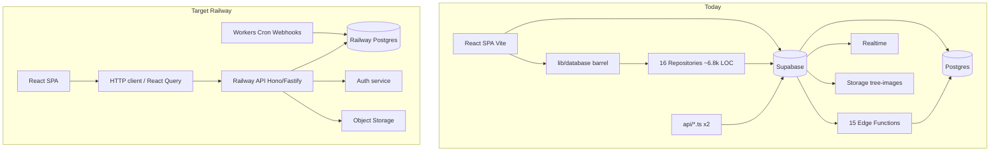

# DirtTrails architecture audit — Railway Postgres migration

| Field | Value |
|-------|--------|
| **Date** | 2026-06-03 |
| **Auditor** | Cursor agent (architecture audit) |
| **Branch / commit** | `main` @ `f387093e` |
| **Skills used** | using-superpowers, improve-codebase-architecture, supabase-postgres-best-practices |
| **Scope** | Full repo (`src/`, `api/`, `db/`, `supabase/`) |

---

## 1. Executive summary

- **Major win:** `src/lib/database.ts` is no longer a ~7,900-line god file — it is a **39-line barrel** re-exporting `src/repositories/` (~6,800 lines across 16 modules). Types are split under `src/types/` by domain.
- **Still not migration-ready:** ~**85** UI modules import `lib/database`; **~90** files still import `supabaseClient` directly. Almost all data access still runs **in the browser** via PostgREST + anon JWT.
- **No test harness:** One manual script (`src/tests/tierEvaluation.test.ts`), no Vitest/Jest, no repository fakes, no API contract tests.
- **No ports layer:** Repositories are concrete Supabase implementations — swapping to Railway Postgres requires a **backend API**, not “point Drizzle at the same URL from React.”
- **Highest migration risk:** **Auth** (Supabase Auth + signup RPCs), **payments** (MarzPay + 15 Edge Functions + payment RPCs), **RLS** (policies in `db/` + `supabase/migrations/`), **Realtime** (payment/wallet/booking channels).
- **Dual migration sources:** `db/` (67 SQL files) and `supabase/migrations/` (14 files) — must be consolidated for Railway.
- **Security:** `api/get-login-history.ts` accepts `VITE_SUPABASE_SERVICE_ROLE_KEY` — service role must never ship in frontend env.
- **Thin `services/` layer:** `BookingService.ts` (26 lines) still calls `supabase.from` directly; heavy logic remains in repositories — shallow orchestration, deep I/O blobs.
- **Starter API:** `api/get-login-history.ts`, `api/trees.ts` (Vercel-style handlers) — good direction but not wired into Vite dev; not the main data path.
- **Recommended first move:** Phase 0 — Docker Postgres + consolidate migrations + introduce `DatabasePort` with one domain strangler (**orders/checkout** or **bookings**) behind a Railway API; stop expanding direct `supabase` in pages.

---

## 2. Risk register

| ID | Area | Risk | Severity | Mitigation | Owner |
|----|------|------|----------|------------|-------|
| R1 | Auth | Signup/login tied to Supabase Auth + `create_user_profile_atomic` / `create_vendor_profile_atomic` RPCs | **H** | Choose Auth.js/Lucia/custom JWT; migrate users; mirror RPC logic in API | |
| R2 | Payments | MarzPay webhooks → Edge Functions; `process_payment_*` RPCs; Realtime payment channels | **H** | Railway worker + idempotent webhook handler; move RPCs to transactions in API | |
| R3 | Data loss | Split migration folders; manual apply per `docs/MIGRATIONS.md` | **H** | Single ordered migration chain; `schema_migrations` table; staging restore test | |
| R4 | Downtime | Big-bang cutover of PostgREST + Auth + Storage + Realtime | **M** | Strangler by domain; dual-write window if needed | |
| R5 | Security | Browser anon key + RLS; service role in `api/` via `VITE_*` fallback | **H** | API-only DB access; server env only; audit RLS → middleware | |
| R6 | Realtime | 20+ `supabase.channel` subscriptions for payments/dashboards | **M** | SSE/WebSockets on API, or polling until parity | |
| R7 | Storage | `tree-images` bucket policies in SQL | **M** | S3/R2 compatible storage + signed URLs | |

---

## 3. Supabase surface area (coupling map)

### 3.1 Inventory table

| Surface | Locations (paths) | Count / notes | Railway migration |
|---------|-------------------|---------------|-------------------|
| PostgREST (`from`, `select`, …) | `src/repositories/*`, `src/services/BookingService.ts`, ~90 files via `supabaseClient` | Dominant | → API routes + server query layer |
| `supabase.rpc` | 30+ call sites across repositories, `AuthContext`, `concurrency.ts`, `creditWallet.ts`, conservation pages, `vendorStore` | **40+ distinct RPC names** (booking, payment, visitor, reviews, tiers) | → SQL transactions in API or keep as DB functions |
| RLS policies | `db/*.sql` (e.g. `006_visitor_activity_tracking.sql`, `012_policies_trees.sql`, `004_user_preferences.sql`), `supabase/migrations/*` | 20+ policy files (grep) | → API authz + optional DB roles |
| `supabase.auth` | `AuthContext.tsx` (~9), booking pages, vendor/admin settings, OTP/reset flows | ~35 files touch auth | → dedicated auth service |
| `supabase.storage` | `admin/conservation/Trees.tsx`, `conservation/Geotagging.tsx`, `lib/imageUpload.ts` | `tree-images` bucket | → object storage adapter |
| Edge Functions | `supabase/functions/` — **15** `index.ts` handlers | MarzPay, emails, queues, OTP, reconcile | → Railway services + cron |
| Realtime | `useOrderPaymentFlow`, booking pages, `hook.ts`, vendor dashboard, `PricingBreakdown`, `useUnreadMessages` | Payment + wallet + booking + pricing | → SSE/polling/WebSocket server |
| Service role in frontend | `serviceClient.ts` **removed** ✓ | — | Keep removed |
| Service role in `api/` | `api/get-login-history.ts` lines 7–8 | Falls back to `VITE_SUPABASE_SERVICE_ROLE_KEY` | **Delete VITE fallback** |
| Env vars | `VITE_SUPABASE_URL`, `VITE_SUPABASE_ANON_KEY` | Client bundle | → public API URL only |
| Legacy barrel | `src/lib/database.ts` | Re-exports repositories | → redirect imports to `repositories/` then ports |

### 3.2 Diagram



### 3.3 Direct `supabase` bypasses (outside repositories)

Repositories still use `supabase` internally — expected. **Pages/hooks that bypass `lib/database`:**

| File | Usage | Action |
|------|-------|--------|
| `contexts/AuthContext.tsx` | auth session, signup RPCs, profile | Move to `AuthPort` + API |
| `hooks/useOrderPaymentFlow.ts` | orders, Realtime payment channel | `OrderPort` + server push |
| `hooks/useOrderQuery.ts` | direct queries | Route through `OrderRepository` / API |
| `hooks/hook.ts` | admin bookings Realtime, tiers channel | API + admin subscription |
| `pages/*Booking.tsx` (6+) | payment Realtime channels | Unified checkout payment listener |
| `pages/Payment.tsx`, `Checkout.tsx` | payment flow | Order service on API |
| `pages/conservation/*` | storage upload, RPC donations | Conservation module + API |
| `pages/admin/HeroVideoManager.tsx` | storage | Media API |
| `pages/admin/conservation/Trees.tsx` | storage + many supabase calls | Backend conservation routes |
| `lib/imageUpload.ts`, `lib/concurrency.ts`, `lib/creditWallet.ts` | storage/RPC | Fold into repositories or API |
| `store/vendorStore.ts` | withdrawal RPCs | `WalletPort` |
| `components/BookingDrawer.tsx`, `PricingBreakdown.tsx` | channel + pricing | Use services layer only |
| `pages/VendorLogin.tsx`, `VerifyOtp.tsx`, `ResetPassword.tsx`, etc. | auth | Auth adapter |

---

## 4. Code architecture friction

### 4.1 God module & types

| Issue | Evidence | Impact |
|-------|----------|--------|
| God file split ✓ | `database.ts` → 39 lines, delegates to `repositories/` | Easier navigation; same total complexity |
| Repository blobs | `VisitorRepository` 950, `WalletRepository` 915, `BookingRepository` 781, `InquiryRepository` 777 lines | Hard to test; mixed I/O + business rules |
| Import habit | ~85 files still `from '../lib/database'` | Indirection hides new structure |
| Direct supabase | ~90 files `supabaseClient` | Bypasses repository boundary |
| Types ✓ | `src/types/{auth,vendor,service,booking,payment,review,partner}.ts` | Good; keep as domain types |
| Shallow services | `BookingService.ts` 26 lines — raw `supabase.from('bookings').update` | Pages should not need service if repo exists; service should orchestrate repo |
| Duplicate pricing paths | `lib/pricingService.ts` + `services/PricingService.ts` + `PricingRepository` | Confusing entry points |
| Backup noise | `database.ts.backup`, `Partnerships.tsx.backup` | Remove or gitignore |

### 4.2 Domain clusters

| Domain | Key files | Coupled to |
|--------|-----------|------------|
| Bookings | `BookingRepository`, `BookingService`, booking pages, `createBookingAtomicRpc` | Orders, payments, emails Edge Fn |
| Orders / checkout | `OrderRepository`, `Checkout`, `Payment`, `useOrderQuery` | MarzPay, Realtime, wallet RPCs |
| Services | `ServiceRepository`, `ServiceRequestRepository`, `hook.ts` | Storage, tiers, pricing RPCs |
| Auth / profiles | `AuthContext`, `AuthRepository` | Supabase Auth, profile/vendor RPCs |
| Messages | `MessageRepository`, E2E `encryption.ts` | Realtime, encrypted columns migration |
| Wallet / payments | `WalletRepository`, `creditWallet`, MarzPay functions | Commission RPCs, vendor store |
| Reviews | `ReviewRepository`, `ServiceReviews*` | Visitor session, moderation RPCs |
| Visitor tracking | `VisitorRepository`, `useVisitorTracking` | IP lookup, visitor RPCs |
| Admin | `AdminRepository`, `admin/*` pages | Service role patterns, finance |
| Vendor | `VendorRepository`, `vendorStore`, `vendor/*` | Tiers, withdrawals |
| Conservation | `Trees.tsx`, `Geotagging`, `api/trees.ts` | Storage, trees table |
| Partners | `PartnerRepository`, `PartnerWithUs` | RLS on partners |

### 4.3 Dependency classification (deep-module lens)

| Module / cluster | Category | Notes |
|------------------|----------|-------|
| `tierEvaluationService`, `bookingFormValidation`, `utils` | **1 In-process** | Testable today; expand unit tests |
| Repositories (all) | **3 Remote-owned** | Need `DatabasePort` + HTTP adapter for SPA; Postgres adapter on server |
| Supabase Auth | **4 True external** | Replace with auth provider; mock in tests |
| MarzPay | **4 True external** | Mock webhook + API client at port boundary |
| Resend / email Edge Fns | **4 True external** | Email port; Railway worker implements |
| Postgres RPCs | **2 Local-substitutable** (on server) | Test via Docker Postgres + same SQL functions |
| Realtime | **3 Remote-owned** | New subscription port |

---

## 5. Postgres review (best practices)

Reference: Supabase postgres best-practices categories (`query-`, `conn-`, `security-`, `schema-`, `lock-`, `data-`).

### 5.1 Schema & migrations

| Finding | Rule / category | Location | Recommendation |
|---------|-----------------|----------|----------------|
| Two migration trees | `schema-` | `db/` (67 files) + `supabase/migrations/` (14) | Single `migrations/` with timestamp order; document baseline |
| RPC-heavy writes | `data-` | `db/005_concurrency_controls.sql`, booking/payment RPCs | Keep functions on Railway; invoke from API with `SET LOCAL` role |
| Visitor RLS complexity | `security-` | `db/006_visitor_activity_tracking.sql`, `009_fix_visitor_activity_rls.sql` | Move rules to API middleware + session visitor id |
| Checkout indexes | `query-` | `db/026_checkout_indexes.sql` | Verify on Railway after import; `EXPLAIN ANALYZE` hot paths |
| Pricing / tiers | `schema-` | `db/030_*`, `db/035_*`, `supabase/migrations/20260404*` | Already normalized; preserve |
| Fulfillment queue | `lock-` / `data-` | `db/032_create_payment_fulfillment_queue.sql` | Railway cron + `FOR UPDATE SKIP LOCKED` worker |

### 5.2 Hot queries & RPCs

| Flow | Pattern issue | Fix |
|------|---------------|-----|
| `WalletRepository.getTransactions` | Direct select + second query for bookings (N+1 style join) | `query-` — single join or view in API |
| `ServiceRepository` list filters | Dynamic PostgREST filters | Server-side query builder (Kysely/Drizzle) |
| `create_booking_atomic` | Critical path — must stay transactional | Keep DB function; API calls one RPC/transaction |
| `process_payment_with_commission` | Fallback chains in repo (multiple RPC attempts) | One idempotent API endpoint; structured errors |
| Public service browse | RLS + anon | Explicit public read endpoints with cached reads |

### 5.3 RLS → post-Supabase authz

| Policy / table | Current behavior | Proposed replacement |
|----------------|------------------|----------------------|
| `user_preferences` | User-scoped RLS (`db/004`) | API: `WHERE user_id = session.sub` |
| `visitor_*` tables | Session/IP based (`db/006`) | API visitor token + rate limits |
| `trees` | Admin vs public approved (`db/012`, `015`) | Role checks in API |
| `partners` | Public active only (`103`, supabase migrations) | Public GET filter in SQL |
| `payments` admin | `admin_select_payments` migration | `requireRole('admin')` middleware |
| Storage `tree-images` | `db/016_storage_policies` | Signed upload URLs from API |

### 5.4 Railway connection & pooling

| Topic | Recommendation |
|-------|----------------|
| Pooler | **PgBouncer** (transaction mode) on Railway or built-in pooler; API uses pooled URL |
| Max connections | Size pool to API replicas; avoid per-request connections from serverless without pooler |
| Serverless vs long-lived | Prefer **one long-lived Railway API service** over per-invocation DB connects |
| Migrations | Run via CI against staging Railway Postgres before prod |
| Secrets | `DATABASE_URL` server-only; never `VITE_*` for DB |

---

## 6. Deepening candidates (Phase 2)

### Candidate 1: Orders & payments boundary

- **Cluster:** `OrderRepository`, `WalletRepository`, `useOrderPaymentFlow`, `Checkout`, `Payment`, MarzPay Edge Functions, payment Realtime channels
- **Why coupled:** Money path spans RPC fallbacks, client Realtime, and external webhook — highest correctness risk
- **Dependency category:** 3 + 4 (remote DB + MarzPay)
- **Test impact:** Boundary tests for “create order → pay → webhook confirms”; mock MarzPay; Postgres integration for RPCs

### Candidate 2: Auth & identity boundary

- **Cluster:** `AuthContext`, `AuthRepository`, signup RPCs, `VendorLogin`, OTP/reset pages, `api/get-login-history.ts`
- **Why coupled:** Supabase Auth IDs permeate `profiles`, `vendors`, RLS
- **Dependency category:** 4 (auth provider)
- **Test impact:** Session fixture tests; signup/login contract tests without Supabase

### Candidate 3: Booking creation boundary

- **Cluster:** `BookingRepository`, `createBookingAtomicRpc`, category booking pages, `send-booking-emails` Edge Fn
- **Why coupled:** Atomic RPC + email side effect + drawer/checkout flows
- **Dependency category:** 3
- **Test impact:** Integration test: book → confirm → email job enqueued (mock email port)

### Candidate 4: Data access facade (repositories → ports)

- **Cluster:** All 16 repositories, `lib/database` barrel, 85 importers
- **Why coupled:** Every feature imports concrete Supabase
- **Dependency category:** 3
- **Test impact:** In-memory `DatabasePort` fake; gradual import migration

### Candidate 5: Visitor & reviews (public surface)

- **Cluster:** `VisitorRepository`, `ReviewRepository`, tracking hooks, public service pages
- **Why coupled:** RLS + RPCs for likes/views/reviews
- **Dependency category:** 2 + 3
- **Test impact:** API tests with anonymous + logged-in sessions

### Recommended priority order

1. **Candidate 1** — Orders & payments (blocks revenue migration)
2. **Candidate 4** — Ports facade (enables all other moves)
3. **Candidate 2** — Auth (hard dependency for everything)
4. **Candidate 3** — Booking creation
5. **Candidate 5** — Visitor/reviews (lower risk, public)

**Question for owner:** Which candidate to explore first? **Suggested: #1 (payments) with #4 (ports) in parallel for Week 1.**

---

## 7. Target architecture

### 7.1 Principles

- Browser talks only to **your API**; Postgres credentials never in Vite env.
- **Deep modules** at service boundaries (checkout, auth, wallet); repositories become server-only adapters.
- **Strangler fig** by domain; keep Postgres RPCs until logic is ported to app transactions.
- **Replace, don’t layer** tests at new boundaries (per improve-codebase-architecture).
- Consolidate migrations before Railway prod cutover.

### 7.2 Folder tree (proposed)

```
dirt-t-frontend/                 # SPA (existing)
  src/
    domain/                      # pure rules (tier eval, pricing math)
    ports/                       # DatabasePort, AuthPort, StoragePort, PaymentPort
    api-client/                  # fetch wrappers for Railway API
    pages/ components/ hooks/   # import api-client + ports only
  api/                           # expand OR packages/api in monorepo

packages/api/  (or server/)      # Railway service
  src/
    routes/                      # bookings, orders, auth, webhooks
    adapters/
      postgres/                  # Drizzle or Kysely + pg pool
      marzpay/
      storage/
      email/
    jobs/                        # fulfillment queue, expire orders, tier cleanup
  migrations/                    # unified from db/ + supabase/migrations
```

### 7.3 Opinionated choices

| Decision | Recommendation | Alternatives considered |
|----------|----------------|-------------------------|
| Query layer | **Drizzle ORM** on Railway API — typed schema, good migrations story | Kysely (SQL-first), raw `pg` (too low-level at this scale) |
| Auth | **Auth.js (v5)** with credentials + session cookies on API, JWT for SPA | Lucia, Clerk, custom JWT only |
| File storage | **Cloudflare R2** or **AWS S3** with presigned URLs | Railway volume (poor fit for images) |
| API framework | **Hono** on Node (lightweight, fits Railway) | Fastify, Express |
| Monorepo vs split | **Monorepo** (`apps/web` + `apps/api` + `packages/types`) — shared types with booking app | Split repos (more release friction) |
| Client data fetching | Keep **TanStack Query** → call `api-client` | Continue supabase-js in browser (reject) |

### 7.4 Edge Functions → Railway map

| Function | Today | Target deployment |
|----------|-------|-------------------|
| `marzpay-collect` | Deno Edge | API route `POST /webhooks/marzpay/collect` |
| `marzpay-webhook` | Deno Edge | API route + idempotent ledger |
| `marzpay-payment-status` | Deno Edge | API route / worker poll |
| `process-payment-fulfillment-queue` | Deno cron | Railway cron job / worker |
| `expire-abandoned-orders` | Deno cron | Railway cron |
| `cleanup-expired-tiers` | Deno cron | Railway cron |
| `send-booking-emails` | Deno | Worker + Resend adapter |
| `send-order-emails` | Deno | Worker queue |
| `send-inquiry-emails` | Deno | Worker queue |
| `send-review-email` | Deno | Worker |
| `send-otp-notification` | Deno | Worker |
| `notify-admin-new-account` | Deno | Worker |
| `verify-password` | Deno | API auth route |
| `report-booking-issue` | Deno | API admin route |
| `reconcile-booking` | Deno | API admin route |

### 7.5 Testing pyramid

| Layer | What to test | Tooling |
|-------|--------------|---------|
| Unit | `tierEvaluationService`, pricing math, validation | **Vitest** |
| Integration | Drizzle repos against Postgres | **Vitest** + Docker Compose Postgres |
| API contract | Routes auth, bookings, payments | **Vitest** + `supertest` or Hono test client |
| E2E | One happy-path booking | Playwright — **defer** until API stable |

---

## 8. Migration roadmap

| Phase | Scope | Exit criteria | Rollback |
|-------|--------|---------------|----------|
| 0 | Unified migrations, Docker local PG, Vitest, remove `VITE_SERVICE_ROLE` | `npm test` runs; local DB mirrors prod schema | N/A |
| 1 | Railway API skeleton + health + auth stub | SPA can hit `/health` | Feature flag |
| 2 | Read-only public routes (services, trees) | Home/category from API | Fallback to Supabase reads |
| 3 | Order/checkout/payment on API | Checkout works on staging | Dual-write payments |
| 4 | Booking writes + email jobs | Create booking E2E staging | Revert route |
| 5 | Auth migration (export users) | Login/signup on new auth | Supabase auth fallback window |
| 6 | Storage + conservation uploads | Trees/geotag on R2/S3 | |
| 7 | Workers (MarzPay, queues, cron) | Webhooks on Railway | DNS cutover |
| 8 | Decommission Supabase | No `supabase-js` in `package.json` | Restore project |

**Strangler fig order:** public reads → orders/payments → bookings → auth → messages/reviews → admin/vendor dashboards → Realtime last.

---

## 9. Week 1 task list

| # | Task | Est. | PR title idea |
|---|------|------|---------------|
| 1 | Add Vitest + first tests for `tierEvaluationService` | S | `chore: add vitest and tier evaluation tests` |
| 2 | `docker-compose.yml` Postgres 16 + apply merged migration baseline | M | `chore: local postgres for dev` |
| 3 | Document single migration order (`db/` → `migrations/0001_...`) | S | `docs: consolidate migration path` |
| 4 | Remove `VITE_SUPABASE_SERVICE_ROLE_KEY` from `api/get-login-history.ts` | S | `fix: server-only service role in api routes` |
| 5 | Add `src/ports/DatabasePort.ts` + in-memory fake (bookings slice) | M | `refactor: introduce DatabasePort for bookings` |
| 6 | Migrate 5 highest-traffic imports `lib/database` → `repositories` | S | `refactor: import repositories directly` |
| 7 | Extract payment Realtime listener to `usePaymentStatus(channelId)` hook | M | `refactor: unify payment realtime subscription` |
| 8 | Spike Hono app `apps/api` with `GET /health` + `GET /services` | M | `feat: api skeleton on railway layout` |
| 9 | `supabase gen types typescript` → `packages/types/database.gen.ts` | S | `chore: generated supabase types` |
| 10 | Delete `database.ts.backup` and `*.backup` pages | S | `chore: remove backup files` |

---

## 10. Open questions (owner decisions)

| # | Question | Options | Decision |
|---|----------|---------|----------|
| 1 | Monorepo now or API repo later? | Turborepo monorepo vs split `dirt-trails-api` | |
| 2 | Auth user migration | Export Supabase users vs fresh cutover | |
| 3 | Keep Postgres RPCs long-term? | Keep vs rewrite in Drizzle transactions | |
| 4 | Realtime parity deadline | Must-have day 1 vs polling interim | |
| 5 | Railway hosting model | Single service vs API + worker services | |

---

## Appendix A — Repository sizes & split targets

| Module | Lines | Split / notes |
|--------|-------|----------------|
| `VisitorRepository.ts` | 950 | `visitor/` + analytics queries |
| `WalletRepository.ts` | 915 | `wallet/` + `payments/` |
| `BookingRepository.ts` | 781 | keep; add port wrapper |
| `InquiryRepository.ts` | 777 | `inquiries/` + email trigger port |
| `ServiceRepository.ts` | 687 | `services/` CRUD |
| `AdminRepository.ts` | 627 | `admin/` read models |
| `OrderRepository.ts` | 489 | **priority** checkout port |
| `ReviewRepository.ts` | 468 | `reviews/` |
| `PricingRepository.ts` | 357 | merge with `PricingService` |
| `MessageRepository.ts` | 349 | `messages/` + encryption adapter |
| Others | <350 | OK |

**~85** importers of `lib/database` · **~3** direct `repositories` imports · **~90** direct `supabaseClient` imports.

## Appendix B — Edge Functions inventory

| Function | Trigger | DB / external deps |
|----------|---------|-------------------|
| `marzpay-collect` | HTTP | Postgres, MarzPay API |
| `marzpay-webhook` | HTTP webhook | Postgres, MarzPay |
| `marzpay-payment-status` | HTTP | Postgres, MarzPay |
| `process-payment-fulfillment-queue` | Cron/HTTP | Queue table, payments |
| `expire-abandoned-orders` | Cron | orders |
| `cleanup-expired-tiers` | Cron | vendor tiers |
| `send-booking-emails` | HTTP | Resend, bookings |
| `send-order-emails` | HTTP | Resend, orders |
| `send-inquiry-emails` | HTTP | Resend |
| `send-review-email` | HTTP | Resend |
| `send-otp-notification` | HTTP | SMS/email |
| `notify-admin-new-account` | HTTP | email |
| `verify-password` | HTTP | auth |
| `report-booking-issue` | HTTP | audit table |
| `reconcile-booking` | HTTP | audit, optional secret |

## Appendix C — Key RPCs (migrate with care)

`create_booking_atomic`, `create_service_atomic`, `update_service_atomic`, `delete_service_atomic`, `process_payment_with_commission`, `process_payment_atomic`, `update_wallet_balance_atomic`, `book_tickets_atomic`, `verify_and_use_ticket_atomic`, `get_effective_pricing`, `create_user_profile_atomic`, `create_vendor_profile_atomic`, `save_user_preferences_atomic`, visitor/review RPCs — inventory full set via `rg "supabase.rpc" src`.

## Appendix D — References

- Audit prompt: `RAILWAY_MIGRATION_ARCHITECTURE_AUDIT_PROMPT.md`
- Template: `docs/architecture/AUDIT_TEMPLATE.md`
- Migrations: `docs/MIGRATIONS.md`
- Project: `PROJECT.md`
- Prior audits: (this file is first dated audit)
